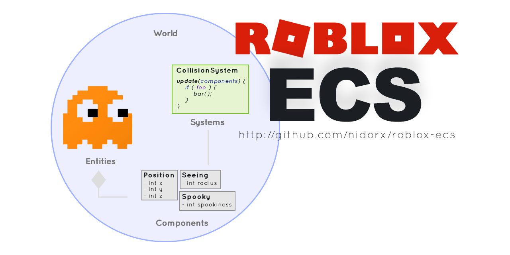
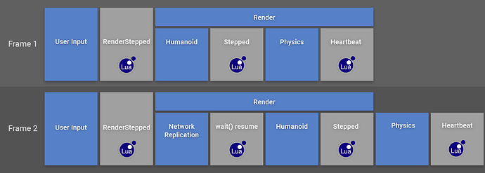
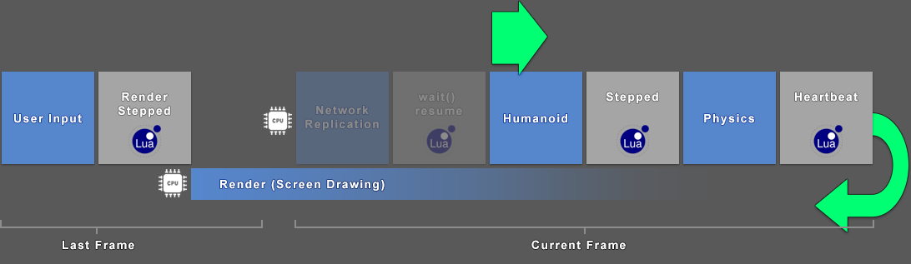
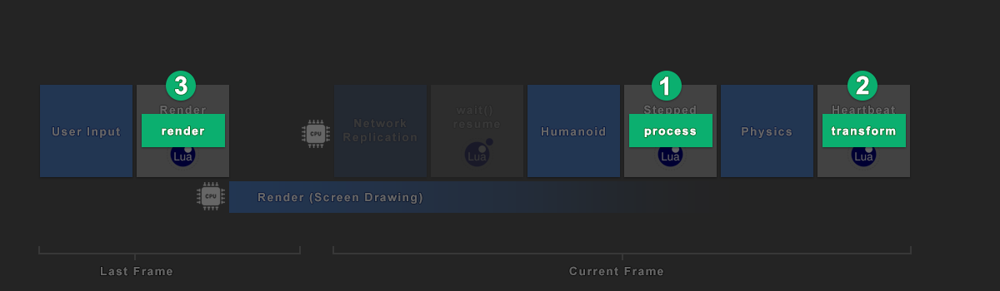
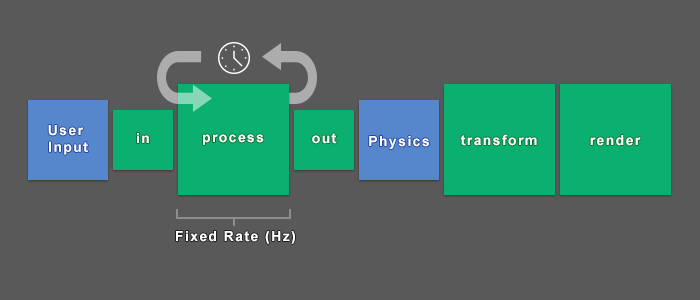

**Roblox-ECS** is a tiny and easy to use [ECS _(Entity Component System)_](https://en.wikipedia.org/wiki/Entity_component_system) engine for game development on the Roblox platform


**TLDR;** There is a [very cool tutorial that shows you in practice how to create a small shooting system](TUTORIAL.md) (The result of this tutorial can be seen at https://github.com/nidorx/roblox-ecs/blob/master/docs/tutorial.rbxl). 

> **IMPORTANT!** This engine is still in development, therefore subject to bugs

## Links

- **Latest stable version**
    - https://www.roblox.com/library/5887881675/Roblox-ECS
- **Forum**
    - https://devforum.roblox.com/t/841175

- [**ECSUtil** - Utility Systems and Components](ECSUtil.md)
   - https://github.com/nidorx/roblox-ecs/blob/master/src/shared/ECSUtil.lua
    
## Installation

You can do the installation directly from Roblox Studio, through the Toolbox search for `Roblox-ECS`, this is the minified version of the engine (https://www.roblox.com/library/5887881675/Roblox-ECS).

If you want to work with the original source code (for debugging or working on improvements), access the repository at https://github.com/nidorx/roblox-ecs

## Entity-Component-System

Entity-Component-System (ECS) is a distributed and compositional architectural design pattern that is mostly used in game development. It enables flexible decoupling of domain-specific behaviour, which overcomes many of the drawbacks of traditional object-oriented inheritance

For further details:

- [Entity Systems Wiki](http://entity-systems.wikidot.com/)
- [Evolve Your Hierarchy](http://cowboyprogramming.com/2007/01/05/evolve-your-heirachy/)
- [ECS on Wikipedia](https://en.wikipedia.org/wiki/Entity_component_system)
- [Entity Component Systems in Elixir](https://yos.io/2016/09/17/entity-component-systems/)
- [2017 GDC - Overwatch Gameplay Architecture and Netcode](https://www.youtube.com/watch?v=W3aieHjyNvw&ab_channel=GDC)

## Roblox Pipeline

Before going into the details, let's review some important concepts about how the Roblox game engine works

Most likely you have seen the illustration below, made by zeuxcg and enriched by Fractality_alt. It describes the roblox rendering pipeline. Let's redraw it so that it is clearer what happens in each frame of a game in roblox

[](https://devforum.roblox.com/t/runservice-heartbeat-switching-to-variable-frequency/23509/7)

In the new image, we have a clear separation (gap between CPU1 and CPU2) of the roblox rendering process, which occurs in parallel with the simulation and processing (game logic) of the next screen

The green arrows indicate the start of processing of the new frame and the return of execution after the completion of the two processes that are being executed in parallel (rendering of the previous screen and processing of the current frame)

The complete information on the order of execution can be seen at https://developer.roblox.com/en-us/articles/task-scheduler

> **note** the distance between the initialization of the two processes in the image is just to facilitate understanding, in Roblox both threads are started at the same time

[](https://developer.roblox.com/en-us/articles/task-scheduler)

Based on this model, Roblox-ECS organizes the execution of the systems in the following events. We call them **steps**



## Roblox-ECS steps

Roblox-ECS allows you to configure your systems to perform in the steps defined below.

In addition to defining the execution step, you can also define the execution order within that step. By default, the order of execution of a system is 50. When two or more systems have the same order of execution, they will be executed following the order of insertion in the world



- **processIn** - Executed once per frame

   This is the first step to be executed in a frame. Use this step to run systems that translate the user's input or the current state of the workspace to entity components, which can be processed by specialized systems in the next steps

   Eg. Use the UserInputService to register the player's inputs in the current frame in a pool of inputs, and, in the PROCESS_IN step, translate these commands to the player's components. Realize that the same logic can be used to receive entries from the server and update local entities that represent other players

   ```lua
   -- InputHandlerUtils.lua
   local UserInputService = game:GetService("UserInputService")

   local pool = { FIRE = false }

   UserInputService.InputBegan:Connect(function(input, gameProcessed)
      if input.UserInputType == Enum.UserInputType.MouseButton1 then
         pool.FIRE = true
      end
   end)

   return pool

   --------------------------------

   -- InputMapSystem.lua
   local ECS = require(game.ReplicatedStorage:WaitForChild("ECS"))
   local FiringComponent = require(game.ReplicatedStorage:WaitForChild("FiringComponent"))

   local pool = require(game.ReplicatedStorage:WaitForChild("InputHandlerUtils"))

   return ECS.RegisterSystem({
      Name = 'InputMap',
      Step = 'processIn',
      Order = 5,
      RequireAll = {
         PlayerComponent
      },
      Update = function (time, world, dirty, entity, index, players)
         local changed = false

         if pool.FIRE then
            world.Set(entity, FiringComponent, { FiredAt = time.frame })
            changed = true
         end

         pool.clear()

         return changed
      end
   })
   ```
- **process** - Executed 0 or more times per frame

   This step allows the execution of systems for game logic independent of Frame-Rate, obtaining determinism in the simulation of the rules of the game

   Independent Frame-Rate games are games that run at the same speed, no matter the frame rate. For example, a game can run at 30 FPS (frames per second) on a slow computer and 60 FPS on a fast one. A game independent of the frame rate progresses at the same speed on both computers (the objects appear to move at the same speed). On the other hand, a frame rate-dependent game advances at half the speed of the slow computer, in a kind of slow motion effect

   Making frame rate independent games is important to ensure that your game is enjoyable and playable for everyone, no matter what type of computer they have. Games that slow down when the frame rate drops can seriously affect gameplay, making players frustrated and giving up! In addition, some systems have screens with different refresh rates, such as 120 Hz, so independence of the frame rate is important to ensure that the game does not accelerate and is impossibly fast on these devices

   This step can also be used to perform some physical simulations that are not met (or should not be performed) by the roblox internal physics engine.

   The standard frequency for executing this step in a world is 30Hz, which can be configured when creating a world

   In the tutorial topic there is a demonstration of the use of interpolation for smooth rendering display even when updating the simulation in just 10Hz

   Read more 
   - [Game Networking (1) - Interval and ticks](https://medium.com/@timonpost/game-networking-1-interval-and-ticks-b39bb51ccca9)
   - [Fix Your Timestep](https://gafferongames.com/post/fix_your_timestep/)
   - [Netcode 101 - What You Need To Know](https://www.youtube.com/watch?v=hiHP0N-jMx8&ab_channel=Battle%28non%29sense)

- **processOut** - Executed once per frame

   Use this step when your systems make changes to the components and these changes imply the behavior of the roblox internal physics simulations, therefore, the workspace needs to receive the update for the correct physics engine simulation

- **transform** - Executed once per frame

   Use this step for systems that react to changes made by the roblox physics engine or to perform transformations on game objects based on entity components (ECS to Workspace)

   Ex. In a soccer game, after running the physics engine, check if the ball touched the net, scoring a point

   Ex2. In a game that is not based on the roblox physics engine, perform the interpolation of objects based on the positions calculated by the specialized systems that were executed in the PROCESS step

- **render** - Executed once per frame

   Use this step to run systems that perform updates on things related to the camera and user interface.

   **IMPORTANT!** Only run light systems here, as the screen design and the processing of the next frame will only happen after the completion of this step. If it is necessary to make transformations on world objects (interpolations, complex calculations), use the TRANSFORM step

### Cleaning phase

At the end of each step, as long as there is dirt, Roblox-ECS sanitizes the environment.

In order to increase performance and maintain the determinism of the simulation, changes that modify the organization of the environment (change in chunks) are applied only in this phase.

At this stage, the following procedures are performed, in that order

1. **Removing entities**
   - If during the execution of the step your system requests the removal of an entity from the world, Roblox-ECS clears the data of that entity in memory but does not immediately remove the entity from Chunk, it only marks the entity for removal, which happens at the moment current (cleaning phase)
2. **Changing the entity's archetype**
   - Entities are grouped in chunk based on their archetype (types of existing components). When you add or remove components from an entity you are modifying its archetype, which should modify the chunk of that entity. When this happens, Roblox-ECS starts to work internally with a copy of that entity, without removing it from the original chunk. This chunk change only occurs during this cleaning phase
3. **Creation of new entities**
   - When a new entity is added to the world by its systems, Roblox-ECS houses that entity in specific chunks of new entities, and only at that moment these entities are copied to their definitive chunk
4. **Invocation of the systems "OnEnter" method**
   - After cleaning the environment, Roblox-ECS invokes the `OnEnter` method for each entity that has been added (or that has undergone component changes and now matches the signature expected by some system)


## Roblox-ECS

We will now know how to create Worlds, Components, Entities and Systems in Roblox-ECS

### World

The World is a container for Entities, Components, and Systems.

To create a new world, use the Roblox-ECS `newWorld` method.

```lua
local ECS = require(game.ReplicatedStorage:WaitForChild("ECS"))

local world = ECS.CreateWorld(

   -- [Optional] systems
   {SystemA, SystemB}, 

   -- [Optional] config
   { 
      Frequency = 30, 
      DisableAutoUpdate = false
   }
)
```


#### World Api


- _`world.`_**`Create`** _()_
  - Create a new Entity
- _`world.`_**`Get`** _(`entity`, `component`)_
  - Get entity compoment data 
- _`world.`_**`Set`** _(`entity`, `component`, `...args`)_
  - Defines the value of a component for an entity
- _`world.`_**`Dirty`** _(`entity`)_
  - It allows informing that this component has undergone some change outside the common flow of systems
  ```lua
  local data = world.Get(entity, Component)
  data.Value = 2
  world.Dirty(entity)
  ```
- _`world.`_**`Call`** _(`entity`, `component`, `method`, `...args`)_
  - Invokes a utility method from a component's API
- _`world.`_**`Remove`** _(`entity`, `component`)_
  - Removing a entity or Removing a component from an entity at runtime
- _`world.`_**`Has`** _(`entity`, `component`)_
  - Check if entity has a component
- _`world.`_**`ForEach`** _(`<ECS.Filter> filter`, `callback`)_
  - Allows you to perform the interaction between all active entities that is compatible with the informed filter
    - `<ECS.Filter> filter` The filter that will be applied to obtain the entities
    - `callback {function(stop, entity, index, [Component_N_Data...]) => bool`  Function that will be invoked for each filtered entity. To stop execution, use the `stop` method received in the parameters. This function should return true if you have made changes to the component or data of the chunk being worked on
- _`world.`_**`AddSystem`** _(`system`, `order`, `config {optional}`)_
  - Add a new system to the world
- _`world.`_**`Alive`** _(`entity`)_
  - Is the Entity still alive?
- _`world.`_**`Destroy`** _()_
  - Remove all entities and systems
- _`world.`_**`Update`** _(`step`, `now`)_
  - Realizes world update
- _`world.`_**`SetFrequency`** _(`frequency`)_
  - Allows you to change the frequency of the 'process' step at run time


### Component

Represents the different facets of an entity, such as position, velocity, geometry, physics, and hit points for example. Components store only raw data for one aspect of the object, and how it interacts with the world

In other words, the component labels the entity as having this particular aspect


```lua
local ECS = require(game.ReplicatedStorage:WaitForChild("ECS"))

return ECS.RegisterComponent(
   -- Name - Unique identifier for this component
   'Box',

   -- [Optional] constructor 
   function( width, height, depth)
      if width == nil then width = 1 end

      return {width, height, depth}
   end,

   -- [Optional] is tag? Defaults false
   false,

   -- [Optional] Api
   {
     MethodA = function(component, paramA){
       return false
     }
   }
)
```

The register method generates a new component type, which is a unique identifier

- **constructor** - you can pass a constructor to the component register. The constructor will be invoked whenever the component is added to an entity
- **Tag component** - The tag component or "zero size component" is a special case where a component does not contain any data. (Eg: **EnemyComponent** can indicate that an entity is an enemy, with no data, just a marker)
- **API** - allows you to add "methods" to that component. The methods are invoked as follows: `world.Call(entity, Component, 'MethodName', param1, paramN)`

### Entity

The entity is a general purpose object. An entity is what you use to describe an object in your game. e.g. a player, a gun, etc. It consists only of a unique ID and the list of components that make up this entity

```lua
local cubeEntity = world.Create()
```

#### Adding and removing components 

At any point in the entity's life cycle, you can add or remove components, using `set` and `remove` methods

```lua
local BoxComponent = require(path.to.BoxComponent)
local ColorComponent = require(path.to.ColorComponent)

-- add components to entity
world.Set(cubeEntity, BoxComponent, 10, 10, 10)
world.Set(cubeEntity, ColorComponent, Color3.new(1, 0, 0))


-- remove component
world.Remove(cubeEntity, BoxComponent)
```

#### Accessing components data

To gain access to the components data of an entity, simply use the `get` method of the `world`

```lua
local color = world.Get(cubeEntity, ColorComponent)
```

#### Check if it is

To find out if an entity has a specific component, use the `has` method of the `world`

```lua
if world.Has(cubeEntity, ColorComponent) then
   -- your code
end
```
#### Remove an entity

To remove an entity, use the "remove" method from the `world`, this time without informing the component.

```lua
world.Remove(cubeEntity)
```

**IMPORTANT!** The removal of the entity is only carried out at the end of the execution of the current step, when invoking the `remove` method, the engine cleans the data of that entity and marks it as removed. To check if an entity is marked for removal, use the `alive` method of the world.

```lua
if not world.Alive(cubeEntity) then
   -- your code
end
```

### System

Represents the logic that transforms component data of an entity from its current state to its next state. A system runs on entities that have a specific set of component types.

In **Roblox-ECS**, a system has a strong connection with component types. You must define which components this system works on in the `System` registry.

If the `Update` method is implemented, it will be invoked respecting the order parameter within the configured step. Whenever an entity with the characteristics expected by this system is added on world, the system is informed via the `OnEnter` method. When these characteristics are lost, the `OnExit` method is invoked 

```lua
local ECS = require(game.ReplicatedStorage:WaitForChild("ECS"))

-- Components
local FiringComponent = require(path.to.FiringComponent)
local WeaponComponent = require(path.to.WeaponComponent)

return ECS.RegisterSystem({
   Name = 'PlayerShooting',

   -- [Optional] defaults to transform
   Step = 'processIn',

   -- [Optional] Order of execution within that step. defaults to 50
   Order = 10,

   -- RequireAll or RequireAny
   RequireAll = {
      WeaponComponent
   },

   --  [Optional] RejectAll or RejectAny
   RejectAny = {
      FiringComponent
   },

   -- [Optional] Invoked when this system is added in a world
   OnCreate = function(world, system)
   end,

   -- [Optional] Invoked when an entity with these characteristics appears
   OnEnter = function(time, world, entity, index, weapons)
      -- on new entity
      print('New entity added ', entity)
      return false
   end,

   -- [Optional] Invoked when an entity loses these characteristics
   OnExit = function(time, world, entity, index, weapons)
      print('Entity loses these characteristics ', entity)
      return false
   end,

   --  [Optional] Invoked when an entity with these characteristics is removed
   OnRemove = function(time, world, entity, index, weapons)
      -- on new entity
      print('Entity removed ', entity)
      return false
   end,

   -- [Optional] Invoked before any update. If false, the BeforeUpdate, Update and AfterUpdate methods will not be invoked for this interaction
   ShouldUpdate = function(time, interpolation, world, system)
      return true
   end,

   --  [Optional] Invoked before executing the update method
   BeforeUpdate = function(time, interpolation, world, system)
      -- called before update
      print(system.config.customConfig)
   end,

   -- [Optional] Invoked for each entity that has the characteristics expected by this system
   Update = function (time, world, dirty, entity, index, weapons)

      local isFiring = UserInputService:IsMouseButtonPressed(
         Enum.UserInputType.MouseButton1
      )

      if isFiring  then
         -- Add a firing component to all entities when mouse button is pressed
         world.Set(entity, FiringComponent, { FiredAt = time.frame })
         return true
      end

      return false
   end,

   --  [Optional] Invoked after executing the update method
   AfterUpdate = function(time, interpolation, world, system)
      -- called before update
      print(system.config.customConfig)
   end
})
```

#### Update

The `Update` method has the following signature:

```lua
update = function (time, world, dirty, entity, index, [component_N_data...])

   local changed = false

   return changed
end
```

- **time** : Object containing the time that the last execution of the `process` step occurred; the time at the beginning of the execution of the current `frame` (processIn); the `delta` time, in seconds passed between the previous and the current frame
   - `{ process = number, frame = number, delta = number }`
- **world**: Reference to the world in which the system is running
- **dirty** : Informs that the chunk (see performance topic) currently being processed has entities that have been modified since the last execution of this system
- **entity** : Entity ID being processed
- **index** : Index, in the chunk being processed, that has the data of the current entity.
- **component_N_data** : The component arrays that are processed by this system. The ordering of the parameters follows the order defined in the `requireAll` or `requireAny` attributes of the system.

As in this architecture you have direct access to the data of the components, it is necessary to inform on the return of the function if any changes were made to this data.

##### Performance TIP, dirty version

As with Unity ECS, Roblox-ECS systems are processed in batch.

Component data is saved in chunks, which allows queries by entities with the expected characteristics to be made more quickly.

In the `Update` method, your system is able to know if this chunk being processed at the moment has entities that have changed, through the `dirty` parameter. Using this parameter you can skip the execution of your system when there has been no change since the last execution of your system for this specific chunk

See that this parameter says only if there are any entities modified in this chunk, but it does not say exactly which entity is

For more details, see the links [The Chunk data structure in Unity](https://gametorrahod.com/the-chunk-data-structure/) and [Designing an efficient system with version numbers](https://gametorrahod.com/designing-an-efficient-system-with-version-numbers/)


#### Adding to the world

To add a system to the world, simply use the `AddSystem` method. You can optionally change the order of execution and pass any configuration parameters that are expected by your system

```lua
local PlayerShootingSystem = require(path.to.PlayerShootingSystem)

world.AddSystem(PlayerShootingSystem, newOrder, { customConfig = 'Hello' })
```

## @Todo

- Remove systems
- Destroy world
- Improve technical documentation
- Perform benchmark with a focus on Data-oriented design
- From the benchmarks, make improvements to the engine
- Prepare for multi-thread?
- Debugging system (External tool? Plugin?)
- Statistics (Per system, per component)
- Template export?
- Facilitate the creation of unit tests
- Facilitate systems benchmark
- Create unit tests for the engine (quality assurance)

## Feedback, Requests and Roadmap

Please use [GitHub issues] for feedback, questions or comments.

If you have specific feature requests or would like to vote on what others are recommending, please go to the [GitHub issues] section as well. I would love to see what you are thinking.

## Contributing

You can contribute in many ways to this project.

### Translating and documenting

I'm not a native speaker of the English language, so you may have noticed a lot of grammar errors in this documentation.

You can FORK this project and suggest improvements to this document (https://github.com/nidorx/roblox-ecs/edit/master/README.md).

If you find it more convenient, report a issue with the details on [GitHub issues].

### Reporting Issues

If you have encountered a problem with this component please file a defect on [GitHub issues].

Describe as much detail as possible to get the problem reproduced and eventually corrected.

### Fixing defects and adding improvements

1. Fork it (<https://github.com/nidorx/roblox-ecs/fork>)
2. Commit your changes (`git commit -am 'Add some fooBar'`)
3. Push to your master branch (`git push`)
4. Create a new Pull Request

## License

This code is distributed under the terms and conditions of the [MIT license](LICENSE).


[GitHub issues]: https://github.com/nidorx/roblox-ecs/issues
