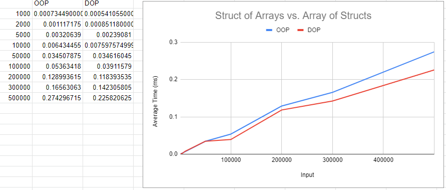

# Roblox-ECS - Technical implementation details

## Roblox Pipeline

Before going into the details, let's review some important concepts about how the Roblox game engine works.

Most likely you have seen the illustration below, made by zeuxcg and enriched by Fractality_alt. It describes the roblox rendering pipeline. Let's redraw it so that it is clearer what happens in each frame of a game in roblox

[](https://devforum.roblox.com/t/runservice-heartbeat-switching-to-variable-frequency/23509/7)

Ready: In the new image, we have a clear separation (gap between CPU1 and CPU2) of the roblox rendering process, which occurs in parallel with the simulation and processing (game logic) of the next screen.

The green arrows indicate the start of processing of the new frame and the return of execution after the completion of the two processes that are being executed in parallel (rendering of the previous screen and processing of the current frame).

The complete information on the order of execution can be seen at https://developer.roblox.com/en-us/articles/task-scheduler

[](https://developer.roblox.com/en-us/articles/task-scheduler)

Based on this model, roblox-ecs-lib organizes the execution of the systems in the following events. We call them steps


### processIn
Executed once per frame.

This is the first step to be executed in a frame. Use this step to run systems that translate the user's input or the current state of the workspace to entity components, which can be processed by specialized systems in the next steps

Eg. Use the UserInputService to register the player's inputs in the current frame in a pool of inputs, and, in the PROCESS_IN step, translate these commands to the player's components. Realize that the same logic can be used to receive entries from the server and update local entities that represent other players

```lua

-- InputHandlerUtils.lua
local UserInputService = game:GetService("UserInputService")

local pool = {
   FIRE = false
}

-- clear frame inputs
function pool.clear()
   pool = {
      FIRE = false
   }
end

UserInputService.InputBegan:Connect(function(input, gameProcessed)
	if input.UserInputType == Enum.UserInputType.MouseButton1 then
		pool.FIRE = true
	end
end)

return pool

---------------------------------------------------------------------------------------

-- InputMapSystem.lua
local ECS = require(game.ReplicatedStorage:WaitForChild("ECS"))
local FiringComponent = require(game.ReplicatedStorage:WaitForChild("FiringComponent"))

local pool = require(game.ReplicatedStorage:WaitForChild("InputHandlerUtils"))

return ECS.System.register({
   name = 'InputMap',
   step = 'processIn',
   order = 5,
   requireAll = {
      PlayerComponent
   },
   update = function (time, world, dirty, entity, index, players)
      local changed = false

      if pool.FIRE then
         world.set(entity, FiringComponent, { FiredAt = time.frame })
         changed = true
      end

      pool.clear()

      return changed
   end
})
```

### process
Executed 0 or more times per frame

This step allows the execution of systems for game logic independent of Frame-Rate, obtaining determinism in the simulation of the rules of the game

Independent Frame-Rate games are games that run at the same speed, no matter the frame rate. For example, a game can run at 30 FPS (frames per second) on a slow computer and 60 FPS on a fast one. A game independent of the frame rate progresses at the same speed on both computers (the objects appear to move at the same speed). On the other hand, a frame rate-dependent game advances at half the speed of the slow computer, in a kind of slow motion effect (read more at https://gafferongames.com/post/fix_your_timestep/).

Making frame rate independent games is important to ensure that your game is enjoyable and playable for everyone, no matter what type of computer they have. Games that slow down when the frame rate drops can seriously affect gameplay, making players frustrated and giving up! In addition, some systems have screens with different refresh rates, such as 120 Hz, so independence of the frame rate is important to ensure that the game does not accelerate and is impossibly fast on these devices.

This step can also be used to perform some physical simulations that are not met (or should not be performed) by the roblox internal physics engine.

The standard frequency for executing this step in a world is 30Hz, which can be configured when creating a world.

In the tutorial topic there is a demonstration of the use of interpolation for smooth rendering display even when updating the simulation in just 10Hz

### processOut
Executed once for the frame

Use this step when your systems make changes to the components and these changes imply the behavior of the roblox internal physics simulations, therefore, the workspace needs to receive the update for the correct physics engine simulation

### transform
Executed once per frame.

Use this step for systems that react to changes made by the roblox physics engine or to perform transformations on game objects based on entity components (ECS to Workspace).

Ex. In a soccer game, after running the physics engine, check if the ball touched the net, scoring a point

Ex2. In a game that is not based on the roblox physics engine, perform the interpolation of objects based on the positions calculated by the specialized systems that were executed in the PROCESS step

### render
Executed once per frame.

Use this step to run systems that perform updates on things related to the camera and user interface.

IMPORTANT! Only run light systems here, as the screen design and the processing of the next frame will only happen after the completion of this step. If it is necessary to make transformations on world objects (interpolations, complex calculations), use the TRANSFORM step

## Architectural decisions, Performance and Benchmarks

Taking into account that on the Roblox platform the development of the logic of our game is done in an interpreted language, roblox-ecs-lib seeks to guarantee the maximum performance of its systems.

Without reinventing the wheel, roblox-ecs-lib mirrors the implementation of the Unity Engine in the following ways:

1. Data oriented design
2. Chunk data storage
3. Efficient systems using version numbers

On the other hand, roblox-ecs-lib does not bring to its implementation all that complexity that exists in the Unity ECS Engine for creating Components or Systems.

The first reason that makes implementation simpler is that roblox-ecs-lib hides the complexities related to Archetypes, Chunks management and EntityManager from the developer.

The second reason for simplification is the fact that Roblox's script execution is Single Thread (there are promises for parallel execution for 2021, let's wait). Although the Lua language allows the use of coroutines, these are only performaticas for processes with high Input / Output consumption, (such as http calls, disk access, etc.), for heavy processing there is no advantage in using coroutines.

A third reason is the difference in the execution flow, which in Roblox is already predefined and roblox-ecs-lib makes use of these events, in its own way, as steps for running systems.

### Data Oriented Design

Data-oriented design is an approach to optimising programs by carefully considering the memory layout of data structures, and their implications for auto-vectorisation and use of the CPU cache (see [An introduction to Data Oriented Design with Rust](http://jamesmcm.github.io/blog/2020/07/25/intro-dod/)).

Roblox-ecs-lib takes into account the organization of data and good practices in order to achieve the maximum performance possible in the execution of the systems. Despite running in interpreted language, many of the performance rules applicable to a C program also have an effect on a Lua program (even if in a smaller proportion). For more details see the scripts available in the `benchmark` directory

**Benchmark: Struct of Arrays vs. Array of Structs**



@TODO: more

### Chunk data storage

@TODO

see [The Chunk data structure in Unity](https://gametorrahod.com/the-chunk-data-structure/)

### Efficient systems using version numbers

@TODO


see [Designing an efficient system with version numbers])(https://gametorrahod.com/designing-an-efficient-system-with-version-numbers/)


- https://www.youtube.com/watch?v=W3aieHjyNvw&ab_channel=GDC
- https://developer.roblox.com/en-us/articles/task-scheduler
- https://medium.com/@timonpost/game-networking-1-interval-and-ticks-b39bb51ccca9
- http://clintonbrennan.com/2013/12/lockstep-implementation-in-unity3d/
- https://www.youtube.com/watch?v=W5lUCeAu_2k&feature=emb_logo&ab_channel=Battle%28non%29sense
- https://www.raywenderlich.com/7630142-entity-component-system-for-unity-getting-started
- https://levelup.gitconnected.com/a-simple-guide-to-get-started-with-unity-ecs-b0e6a036e707
- https://www.raywenderlich.com/7630142-entity-component-system-for-unity-getting-started