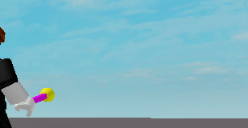

## Roblox-ECS Tutorial - Shooting Game

In this topic, we will see how to implement a simple shooting game, inspired by the [Unity ECS Tutorial - Player Shooting](https://www.youtube.com/watch?v=OQgmIHKXAdg&ab_channel=InfallibleCode)

The first step in using Roblox-ECS is to install the script. In roblox studio, in the Toolbox search field, type "Roblox-ECS". Install the script in `ReplicatedStorage> ECS`.

Now, let's give our character a gun, let's do it via code. Create a `LocalScript` named `tutorial` in `StarterPlayer > StarterCharacterScripts` and add the code below.

 ```lua
repeat wait() until game.Players.LocalPlayer.Character

local Players 	   = game:GetService("Players")
local Player 	   = Players.LocalPlayer
local Character	= Player.Character

local ECS = require(game.ReplicatedStorage:WaitForChild("ECS"))
local ECSUtil = require(game.ReplicatedStorage:WaitForChild("ECSUtil"))

-- Our weapon
local rightHand = Character:WaitForChild("RightHand")
local weapon = Instance.new("Part", Character)
weapon.CanCollide = false
weapon.CastShadow = false
weapon.Size       = Vector3.new(0.2, 0.2, 2)
weapon.CFrame     = rightHand.CFrame + Vector3.new(0, 0, -1)
weapon.Color      = Color3.fromRGB(255, 0, 255)

local weldWeapon = Instance.new("WeldConstraint", weapon)
weldWeapon.Part0 = weapon
weldWeapon.Part1 = rightHand

-- weapon bullet spawn
local BulletSpawnPart   = Instance.new("Part", weapon)
BulletSpawnPart.CanCollide = false
BulletSpawnPart.CastShadow = false
BulletSpawnPart.Color      = Color3.fromRGB(255, 255, 0)
BulletSpawnPart.Size       = Vector3.new(0.6, 0.6, 0.6)
BulletSpawnPart.Shape      = Enum.PartType.Ball
BulletSpawnPart.CFrame     = weapon.CFrame + Vector3.new(0, 0, -1)

local weldBulletSpawn = Instance.new("WeldConstraint", BulletSpawnPart)
weldBulletSpawn.Part0 = BulletSpawnPart
weldBulletSpawn.Part1 = weapon
```

In the code above we are just adding a weapon _(a cube)_ in the character's hands. We make the connection using a `WeldConstraint`, we also add a reference point to use as the initial position of the projectiles (`BulletSpawnPart`) and adjust the CFrame of the same to be on the correct side of the weapon (front).

If you run the code now you will see something like the image below.


All ok, now, to have access to the position of `BulletSpawnPart` within an ECS world, we need to obtain the Position and Rotation of the object from the Workspace and save it as a component of an entity in the ECS world

Roblox-ECS already offers a generic method, some components and systems that already do this synchronization, so let's use it to create our `bulletEntity`

In the script above, before the creation of our weapon, we will define our ECS world, and below, at the end of the script, we will use the Roblox-ECS utility components to synchronize the `BulletSpawnPart` position and rotation

 ```lua
local world = ECS.CreateWorld()
ECSUtil.AddDefaultSystems(world)


local bulletSpawnEntity = ECSUtil.NewBasePartEntity(world, BulletSpawnPart, true, false)
```

The `ECSUtil.NewBasePartEntity` method is a facilitator that adds the `ECSUtil.BasePartComponent`, `ECSUtil.PositionComponent`, `ECSUtil.RotationComponent` components and can also add interpolation and sync tags, it has the following signature: `function ECSUtil.NewBasePartEntity(world, part, syncBasePartToEntity, syncEntityToBasePart, interpolate)`.

In our case, we only want it to sync the data from `BasePart` _(workspace)_ to our `Entity` _(ECS)_.

If you run the project now, you won't see any visual changes, because the systems that are running in this instance of the world don't have any logic that changes the behavior of our game yet.

Now let's create our first component. Thinking about a solution that can be used both on the client and on the server, we will create our components and systems in the `ReplicatedStorage > tutorial` directory. Within this directory we can create two folders, `component` and` system`.

In `ReplicatedStorage > tutorial > component`, create a `ModuleScript` with the name `WeaponComponent` and the contents below

 ```lua
local ECS = require(game.ReplicatedStorage:WaitForChild("ECS"))

return ECS.Component('Weapon')
```
 
That’s it, there’s no logic, no data typing

> **Note** Roblox-ECS does not validate the data handled by the systems, it is the responsibility of the developer to pay attention to the validations

Now, in our `tutorial` script, we will add this feature to our entity. Change the script by adding the code snippets below.

```lua
local Components = game.ReplicatedStorage:WaitForChild("tutorial"):WaitForChild("component")
local WeaponComponent = require(Components:WaitForChild("WeaponComponent"))


world.Set(bulletSpawnEntity, WeaponComponent)
```

Ok. We created the world, we created an entity, we added features but nothing happened on the screen yet. This is because we only add features (components) to our entity, we have not yet defined any behavior that must be performed for those features

With our components and entity defined, it's time to create our first system, let's call it `PlayerShootingSystem`

For a better separation of responsibilities, we will divide our weapon system into two distinct systems, the first, `FiringSystem` will be responsible only for creating new projectiles in the workpace whenever necessary. The `PlayerShootingSystem`, which we are creating now, will be the responsible for notifying the `FiringSystem` when it is time to create new projectiles. It does this by monitoring user input and whenever the mouse button is clicked, it adds a tag component to our entity, indicating that a projectile must be created

Before moving on, let's create this component now. Create a `ModuleScript` in` ReplicatedStorage > tutorial > component` with the name `FiringComponent` and add the content below

 ```lua
local ECS = require(game.ReplicatedStorage:WaitForChild("ECS"))

return ECS.Component('Firing', nil, true)
```

Now, going back to our system, create a `ModuleScript` in `ReplicatedStorage > tutorial > system` with the name `PlayerShootingSystem` and the content below. This system is responsible for adding the `FiringComponent` tag to the entity that has the `WeaponComponent` component whenever the mouse button is pressed. Realize that when we make changes to the data currently being processed (entity or data array), it is necessary that our `update` method returns `true`, so that Roblox-ECS can inform other systems that this chunk has been changed, using dirty parameter

 ```lua
local UserInputService = game:GetService("UserInputService")
local ECS = require(game.ReplicatedStorage:WaitForChild("ECS"))

local Components = game.ReplicatedStorage:WaitForChild("tutorial"):WaitForChild("component")
local FiringComponent = require(Components:WaitForChild("FiringComponent"))
local WeaponComponent = require(Components:WaitForChild("WeaponComponent"))

return ECS.RegisterSystem({
   name = 'PlayerShooting',
   step = 'process',
   order = 1,
   requireAll = {
      WeaponComponent
   },
   update = function (time, world, dirty, entity, index, weapons)

      local isFiring = UserInputService:IsMouseButtonPressed(Enum.UserInputType.MouseButton1)

      if isFiring  then
         world.Set(entity, FiringComponent)
         return true
      end

      return false
   end
})
```

Continuing, we will now create the system responsible for creating the projectiles whenever our entity receives the tag `FiringComponent`, this will be the `FiringSystem`

Create a `ModuleScript` in `ReplicatedStorage > tutorial > system` with the name `FiringSystem` and the contents below. This system is responsible only for creating 3D objects in the scene that represent our projectiles. Realize that this system does not have the `update` method, as it is only interested in knowing when an entity with the expected characteristics appears in the world.

To correctly position our projectiles, this system uses data from the `ECSUtil.PositionComponent` and `ECSUtil.RotationComponent` components, which were added up there by the `ECSUtil.NewBasePartEntity` method during the creation of our entity. In order for our projectile to move, we added the `ECSUtil.MoveForwardComponent` and `ECSUtil.MoveSpeedComponent` components that are used by the `ECSUtil.MoveForwardSystem` system (Automatically added when creating the world)

Also note that our system has not made any changes to the current `chunk` or even the entity, so it always returns `false`

```lua

local ECS = require(game.ReplicatedStorage:WaitForChild("ECS"))

local Components = game.ReplicatedStorage:WaitForChild("tutorial"):WaitForChild("component")
local FiringComponent = require(Components:WaitForChild("FiringComponent"))

return ECS.RegisterSystem({
   name = 'Firing',
   step = 'process', 
   requireAll = {      
      ECSUtil.PositionComponent,
      ECSUtil.RotationComponent,
      FiringComponent
   },
   onEnter = function(time, world, entity, index,  positions, rotations, firings)

      local position = positions[index]
      local rotation = rotations[index]
      
      if position ~= nil and rotation ~= nil then
         -- can be made in a utility script, or clone a preexistece model
         local bulletPart = Instance.new("Part")
         bulletPart.Anchored     = true
         bulletPart.CanCollide   = false
         bulletPart.Position     = position
         bulletPart.CastShadow   = false
         bulletPart.Shape        = Enum.PartType.Ball
         bulletPart.Size         = Vector3.new(0.6, 0.6, 0.6)
         bulletPart.CFrame       = CFrame.fromMatrix(position, rotation[1], rotation[2], rotation[3] * -1)
         bulletPart.Parent       = game.Workspace

         local bulletEntity = ECSUtil.NewBasePartEntity(world, bulletPart, false, true)
         world.Set(bulletEntity, ECSUtil.MoveForwardComponent)
         world.Set(bulletEntity, ECSUtil.MoveSpeedComponent, 0.1)
      end

      return false
   end
})
```

Now, let's add our systems to the world. Change the `tutorial` script by adding the codes below.

```lua
local Systems = game.ReplicatedStorage:WaitForChild("tutorial"):WaitForChild("system")
local FiringSystem         = require(Systems:WaitForChild("FiringSystem"))
local PlayerShootingSystem = require(Systems:WaitForChild("PlayerShootingSystem"))

world.AddSystem(FiringSystem)
world.AddSystem(PlayerShootingSystem)
```

Okay, let's test our game.


Perfect, everything went completely well, except for one thing. We can only shoot once. Let's understand what's wrong:

Our `FiringSystem` is carrying out the expected behavior, creating projectiles whenever an entity with those characteristics appears in the world, `PlayerShootingSystem` is also carrying out what we expect, whenever we use the mouse click it defines that our entity has the `FiringComponent`, however, this `FiringComponent` feature never ceases to exist, it is being added only once, so the `onEnter` method of `FiringSystem` is only invoked once. Therefore, we need to remove the entity's `FiringComponent` after some time so that the `onEnter` method can be triggered more often.

To do this we will create a new system, its name will be `CleanupFiringSystem`, it will be responsible for removing the `FiringComponent` component from our entity after a period of time. In order for `CleanupFiringSystem` to do its job we need to change `FiringComponent`. It will stop being a component tag and start saving the moment of its creation, so that `CleanupFiringSystem` can validate this time and decide if it will remove it from the entity or not

Let's change the `ReplicatedStorage > tutorial > component > FiringComponent.lua` script to the content below. Our component now has a constructor, used to validate the input data and is no longer a tag component

```lua
local ECS = require(game.ReplicatedStorage:WaitForChild("ECS"))

return ECS.Component('Firing', function(firedAt)
   if firedAt == nil then
      error("firedAt is required")
   end

   return firedAt
end)
```

If you run the code now and try to shoot, you will see the following error in Roblox Studio's output:

```log
21:21:39.043 - ReplicatedStorage.tutorial.component.FiringComponent:5: firedAt is required
21:21:39.044 - Stack Begin
21:21:39.044 - Script 'ReplicatedStorage.tutorial.component.FiringComponent', Line 5
21:21:39.045 - Script 'ReplicatedStorage.ECS', Line 1349
21:21:39.045 - Script 'ReplicatedStorage.tutorial.system.PlayerShootingSystem', Line 22
21:21:39.045 - Script 'ReplicatedStorage.ECS', Line 1096
21:21:39.046 - Script 'ReplicatedStorage.ECS', Line 1635
21:21:39.047 - Script 'ReplicatedStorage.ECS', Line 1787
21:21:39.047 - Stack End
```

Note that `PlayerShootingSystem` is trying to add a `FiringComponent` to our entity, but the constructor method performed the validation and prevented the creation of the entity

We will update the `ReplicatedStorage > tutorial > system > PlayerShootingSystem.lua` script with the change below, when adding the component, we will pass to the constructor the current frame instant (`time.frame`)

```lua
if isFiring  then
   world.Set(entity, FiringComponent, time.frame)
   return true
end
```

Ok, now that we are correctly starting `FiringComponent` with a moment for validation, we will create `CleanupFiringSystem`

Create a `ModuleScript` in `ReplicatedStorage > tutorial > system` with the name `CleanupFiringSystem` and the contents below. This system is responsible for removing the `FiringComponent` component after some time. This will allow the `FiringSystem` `onEnter` method to be invoked more often. In our implementation, we define that after `0.5` seconds the information that the shot was taken is removed from our entity, allowing it to be fired again in the sequence

```lua
local ECS = require(game.ReplicatedStorage:WaitForChild("ECS"))

local Components = game.ReplicatedStorage:WaitForChild("tutorial"):WaitForChild("component")
local FiringComponent = require(Components:WaitForChild("FiringComponent"))

return ECS.RegisterSystem({
   name = 'CleanupFiring',
   step = 'process',
   requireAll = {
      FiringComponent
   },
   update = function (time, world, dirty, entity, index, firings)

      local firedAt = firings[index]
      if firedAt ~= nil then
         if time.frame - firedAt < 0.5 then
            return false
         end

         world.Remove(entity, FiringComponent)

         return true
      end

      return false
   end
})
```

We will also change the `tutorial` script to add the new system to the world

```lua
local CleanupFiringSystem  = require(Systems:WaitForChild("CleanupFiringSystem"))


world.AddSystem(CleanupFiringSystem)
```

OK, now we can shoot more than once, however, we still have another problem. Realize that by pressing and holding the mouse button, our weapon does not fire anymore, it is only firing if I click, wait `0.5` seconds and click again

This is happening because the `update` method of `PlayerShootingSystem` is being invoked with each new frame, updating the time of the `FiringComponent` of our entity in each update (`world.Set(entity, FiringComponent, time.frame)`) , this means that the logic of `CleanupFiringSystem` is not validated, since the elapsed time (`firedAt`) never exceeds 0.5 seconds. We need to filter this behavior.

Let's change the `PlayerShootingSystem` to obtain the desired behavior. We want him to add the `FiringComponent` to any entity that does not yet have this component, so he will never make changes to the data for that component.

Let's change the script `ReplicatedStorage > tutorial > system > PlayerShootingSystem.lua` with the code snippet below, applying a component filter, which at the moment only has `requireAll`, we will also add the `rejectAny` field, so that the method `Update` ignore entities that already have this component.

```lua
requireAll = {
   WeaponComponent
},
rejectAny = {
   FiringComponent
}
```

Okay, now we have the expected behavior, when pressing and holding the left mouse button, our weapon fires several projectiles respecting the interval defined in `CleanupFiringSystem`



However, you noticed one thing: The animation of our projectile is terrible, the projectiles are teleporting from one point to another, the animation of the movement is not smooth as expected

This happens due to **Fixed Timestep Jitter**, we will understand in the next topic


### Fixed Timestep Jitter

In our project, the system responsible for the movement of our projectiles is `ECSUtil.MoveForwardSystem`. The `update` method of this system is invoked 30 times per second, which is the standard update frequency for the `process` step of Roblox-ECS. Therefore, even though our game is being rendered at more than 60FPS, the simulation performed by this system is limited, causing this unwanted effect in the animation

To work around the problem we have two solutions:

**1 - Increase the frequency of our simulation**

At first glance, this seems to be the most suitable solution, just increase the frequency of our simulation to 60, 90 or 120Hz and our animation will be smooth

From a technical point of view this is true, our animation will run smoothly, but in return we will be spending a lot more computational resources to run all the systems that are programmed to update in the `process` step, and that is not a good thing

In addition to spending unnecessary processing resources, this will increase the battery consumption of mobile devices and, if the player's device (whether computer or cell phone) does not have enough processing power the heavy simulation will cause the FPS to drop in rendering

Another problem is if you increase the frequency of the simulation on your server, which in addition to having limited processing power needs to process data from all players simultaneously, decreasing the overall quality of your game

Just for the sake of experimentation, we will increase the frequency of execution of our world. Change the `tutorial` script to the following world boot configuration:

```lua
local world = ECS.CreateWorld(nil, { frequency = 60 })
```


Okay, you already noticed that the animation of our projectiles were smooth, but this at an expensive computational cost (and unnecessary in our case). This change causes the `process` step of the world to be performed at a frequency of 60Hz (60 times per second)

This is not the best solution, let's use something more efficient

**2 - Do Interpolation**

Interpolation is a technique that allows, from two values ​​(A and B), to calculate a third value (C) that represents a ratio between A and B.

Example:
   - If `A = 0` and `B = 10`, for the ratio of `0.5` the value of `C = 5` _(C is between A and B exactly 0.5)_
   - If our ratio were `0.95`, the `C` value would be `9.5`

In game development, we use interpolation to calculate a spatial position _(`Vector3`)_, or a rotation that is between two previously calculated values ​​_(position of the previous frame and position of the last simulation)_ using the elapsed time as a factor _(if the simulation takes 0.24 seconds and 0.12 seconds has passed since the last simulation, the factor is ~ 0.5)_

With that, we can reduce the frequency of the simulation _(heavy calculation)_, save the last two positions/rotations and apply the interpolation as we render the screen, in our case, doing this in the `transform` step _(which is running at a higher frequency, 60FPS for example)_

Roblox-ECS already offers the interpolation factor _(interpolationAlpha)_ to be used in systems that wish to apply the interpolation. It also already provides a data synchronization system between the position and rotation of the entity to update the `BasePart` through this interpolation.

We will then make the changes to verify the use of interpolation and decrease the cost of processing our game.

In the `tutorial` script, we will decrease the execution frequency of the world, say for 10Hz

```lua
local world = ECS.CreateWorld(nil, { frequency = 10 })
```


If you run the game now you will see that the animation is horrible, we will now inform you that we want to use interpolation in the entities of our projectiles.

Change the `ReplicatedStorage > tutorial > system > FiringSystem.lua` script, in the line where our bulletEntity is initializing, using the utility method, modify it

```lua
local bulletEntity = ECSUtil.NewBasePartEntity(world, bulletPart, false, true)
```

to

```lua
local bulletEntity = ECSUtil.NewBasePartEntity(world, bulletPart, false, true, true)
```

Informing that we want an entity that receives the tags and components used by the system if interpolated synchronization.

The result, as expected, is a totally smooth animation and using minimal CPU resources in the `process` step (only 10 times per second)


And we come to the end of the tutorial, for more information on these concepts, see
- [Game Loop by Robert Nystrom](http://gameprogrammingpatterns.com/game-loop.html)
- [Fix Your Timestep! by Glenn Fiedler](https://gafferongames.com/post/fix_your_timestep/)
- [The Game Loop By Gilles Bellot](https://bell0bytes.eu/the-game-loop/)
