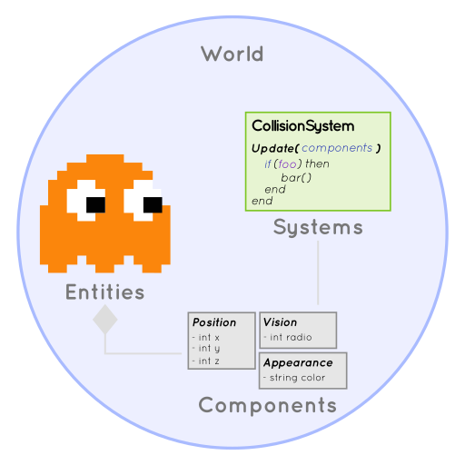
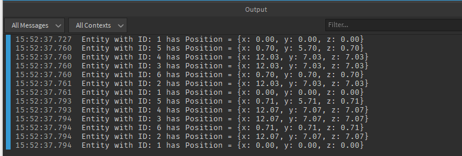

# Installation

**ECS Lua** has no external dependencies, so just download the latest version available on 
[releases page](https://github.com/nidorx/ecs-lua/releases) of the project.

There are 3 options to use **ECS Lua**

1. **ECS.lua** Minified version in a single file
1. **ECS_concat.lua** Version concatenated with the original comments, which can be used for debugging during the
development
1. **ECS.zip** Version with files from the `src` directory.
   > Important! All files do the `require` for dependencies that are in the same directory, if it is
   using in a Lua project, register in `package.path`.

   > These `require` do not work in Roblox Luau, due to the import format that Roblox uses.

After importing **ECS Lua**, it is ready to be used. **ECS Lua** registers the global variable `_G.ECS` to
make it easy to use, so you can use the engine in both ways `local ECS = require("ECS")`
(in Roblox `local ECS = require(game.ReplicatedStorage:WaitForChild("ECS"))`) or simply `_G.ECS`.

## LoopManager

In order for the world's systems to receive an update, the `World:Update(step, now)` method must be invoked on each 
frame. To automate this process, **ECS Lua** provides a functionality so that, at the time of instantiation of a 
new world, it registers to receive the update automatically.

The implementation of this method is very simple and more details can be seen in the section
[Architecture - World](/architecture?id=world).

> If you use Roblox you don't need to worry, **ECS Lua** already has a default implementation when it runs on
Roblox, more details below.

## Roblox

You can install directly from Roblox Studio by searching the toolbox for `ECS-lua`, this is the 
[minified engine version](https://www.roblox.com/library/5887881675). When using **ECS Lua** in Roblox, the engine 
already automatically identifies and registers a `LoopManager`, so no additional steps are needed.

# General Concepts

Some common terms in ECS engines are:
- [Entities](/architecture?id=entity): An object with a unique ID that can have multiple components attached to it.
- [Components](/architecture?id=component): Different characteristics of an entity. eg geometry, physics, hit points. Data is only stored in components.
- [Systems](/architecture?id=system): It does the real work, applying the rules of the game, processing entities and modifying their components.
- [Queries](/architecture?id=query): Used by systems to determine which entities they are interested in, based on the components the entities have.
- [World](/architecture?id=world): A container for entities, components, systems and queries.



The normal workflow when building an ECS-based program:
- Create the `Components` that shape the data you need to use in your game/application.
- Create the `Systems` that will use these `Components` to read and transform the entity data.
- Create `Entities` and attach `Components` to them.
- Run all systems at each frame, perform `Query` in `World` to decide which entities will be modified.

## Component

Components are objects that contain data. In **ECS Lua**, just call the `ECS.Component(template)` method to define a 
`Class` of a component.

The `template` parameter can be of any type, where:
- When `table`, this template will be used for creating component instances;
- When it's a `function`, it will be invoked on instantiation.
- If the template type is different, **ECS Lua** will generate a template in the format `{ value = template }`, this is 
the format used in the `Acceleration` component below.

```lua
local Position = ECS.Component({ 
   x = 0, y = 0, z = 0 
})

-- the same as:
-- ECS.Component({ value = 0.1 })
local Acceleration = ECS.Component(0.1) 
```
[More information on creating components](/architecture?id=component).

## Systems and Queries

Now let's define a [system](/architecture?id=system) to process the components we just created. One system can implement
several methods, in this exercise we will just use the `Update(Time)` method. This method will be invoked on every 
frame, in the world's `process` step.

To create a system, we use the `ECS.System(step, order, query, updateFn)` method. This method receives the following
parameters:
- **`step`** String, accepts the values `process`, `transform`, `render` or `task`
- **`order`** Number (Optional) Allows you to set an execution order (for systems that are not `task`). Default 50
- **`query`** Query (Optional) Filters the entities that will be processed by this system
- **`updateFn`** Function (Optional) A shortcut for creating systems that only have the Update method

We're also going to define a `Query`, which is the query we'll use to get just the entities we're interested.

To create the query, we can use the `Query.All(Component)`, `Query.Any(Component)` or `Query.None(Component)`. When 
invoking any of these methods a `QueryBuilder` is returned, so you can invoke the other methods in sequence 
Ex. `Query.All(ComponentA).Any(ComponentB).None(ComponentC).Build()`.


Let's start by creating a system that will loop through all entities that have a `Position` component and record their 
positions.

```lua
-- a shortcut to methods
local System, Query = ECS.System, ECS.Query 

local PositionLogSystem = System("process", 2, Query.All(Position), function(self, Time)

   -- Iterate through all entities in the query
   self:Result():ForEach(function(entity)
      -- Access the `Position` component in the current entity
      local pos = entity[Position]

      local msg = "Entity with ID: %d has Position = {x: %0.2f, y: %0.2f, z: %0.2f}"
		print(msg:format(entity.id, pos.x, pos.y, pos.z))
   end)
end)
```

The next system moves each entity that has a position and an acceleration.

```lua
local MovableSystem = System("process", 1, Query.All(Acceleration, Position)) 

-- This method will be called on all frames by default.
function MovableSystem:Update(Time)

   local delta = Time.DeltaFixed

   -- Iterate through all entities in the query
   for i, entity in self:Result():Iterator() do
      local acceleration = entity:Get(Acceleration).value

      local position = entity[Position]
      position.x = position.x + acceleration * delta
      position.y = position.y + acceleration * delta
      position.z = position.z + acceleration * delta
   end
end
```

> Note that we are accessing components in an entity in two different ways: `entity:Get(Acceleration)` has the
same result as `entity[Acceleration]`

The system query `MovableSystem` filters the entities that have the components `Acceleration` and
`Position`. Note that, if necessary, we can create as many queries as we like and process them in the `Update` method, eg:

```lua
local SystemDemo =  System("process", 1)  

function SystemDemo:Initialize(config)
   self.queryBoxes = Query.All(Box).Build()
   self.queryBalls = Query.All(Ball).Build()
   self.queryGeometries = Query.Any(Box, Ball).Build()
end

function SystemDemo:Update(Time)
   local boxes = self:Result(self.queryBoxes):ToArray()
   local balls = self.World:Exec(self.queryBalls):ToArray()
   for i, entity in self:Result(self.queryGeometries):Iterator() do
      print(entity[Box], entity[Ball])
   end
end
```

For more information, check the architecture documentation: [Components](/architecture?id=component), 
[Entities](/architecture?id=entity) and [Queries](/architecture?id=query)


## World

A world is a container for `entities`, `components` and `systems`. Most games have only one `world`, however, you can 
have multiple worlds running at the same time and enable or disable them as needed.

Creating a world is done by the `ECS.World(systemClasses, frequency, disableAutoUpdate)` method, where:

- **systemClasses** (optional) Array of system classes 
- **frequency** Number (optional) Define the frequency that the `process` step will be executed. Default 30
- **disableAutoUpdate** Bool (optional) When `~= false`, the world automatically registers in the 
`LoopManager`, receiving the `World:Update()` method from it. Default false

Let's start creating our world:

```lua
local world = ECS.World();
```

Now let's register our systems in the world so that they start up and run on every frame.

```lua
world:AddSystem(PositionLogSystem)
world:AddSystem(MovableSystem)
```

## Entity

Having our world, some components and systems already defined, let's create [entities](/architecture?id=entity) and 
attach these components to them:

```lua
local entity1 = world:Entity(Position())

local entity2 = world:Entity(
   Position({x = 5}), 
   Acceleration(1)
)

local entity3 = world:Entity(
   Position.New({x = 5}), 
   Acceleration.New(1)
)

local entity4 = world:Entity(
   Position({x = 5}), 
   Acceleration({value = 1})
)

local entity5 = world:Entity()
entity5[Position] = { y = 5 }
entity5:Set(Acceleration())

local entity6 = world:Entity()
entity6[Position] = Position()
entity6:Set(Acceleration())
```

With that, we have just created 6 entities. 5 with the `Acceleration` and `Position` components, and one with just 
the `Position` component.

Note that there are several ways to instantiate and assign components to the entity, choose the one that best matches
with your programming style, the end result is the same. Also note that component classes can be used 
[as functions](http://lua-users.org/wiki/FuncTables), for example `Position()`. This format has the same effect 
than `Position.New()`.

## Putting everything together

Now the world just needs to be updated (`world.Update(step, now)`) for everything to work. If you use roblox, just
create a Local Script that the world will automatically update.


```lua
-- Roblox:
local ECS = require(game.ReplicatedStorage:WaitForChild("ECS"))

-- a shortcut to methods
local Component, System, Query = ECS.Component, ECS.System, ECS.Query 

-- Components
local Position = Component({ x = 0, y = 0, z = 0 })
local Acceleration = Component(0.1)

-- Sistems
local PositionLogSystem = System("process", 2, Query.All(Position), function(self, Time)

   -- Iterate through all entities in the query
   self:Result():ForEach(function(entity)
      -- Access the `Position` component in the current entity
      local pos = entity[Position]

      local msg = "Entity with ID: %d has Position = {x: %0.2f, y: %0.2f, z: %0.2f}"
		print(msg:format(entity.id, pos.x, pos.y, pos.z))
   end)
end)

local MovableSystem = System("process", 1, Query.All(Acceleration, Position)) 

-- This method will be called on all frames by default.
function MovableSystem:Update(Time)

   local delta = Time.DeltaFixed

   -- Iterate through all entities in the query
   for i, entity in self:Result():Iterator() do
      local acceleration = entity:Get(Acceleration).value

      local position = entity[Position]
      position.x = position.x + acceleration * delta
      position.y = position.y + acceleration * delta
      position.z = position.z + acceleration * delta
   end
end

-- World
local world = ECS.World();
world:AddSystem(PositionLogSystem)
world:AddSystem(MovableSystem)

-- Entities
local entity1 = world:Entity(Position())
local entity2 = world:Entity(Position({x = 5}), Acceleration(1))
local entity3 = world:Entity(Position.New({x = 5}), Acceleration.New(1))
local entity4 = world:Entity(Position({x = 5}), Acceleration({value = 1}))

local entity5 = world:Entity()
entity5[Position] = { y = 5 }
entity5:Set(Acceleration())

local entity6 = world:Entity()
entity6[Position] = Position()
entity6:Set(Acceleration())
```

Result of the above code in Roblox Studio



## Next steps
This was a quick overview of how things are structured using **ECS Lua**,
[read the architecture documentation](/architecture) for more detailed information.
