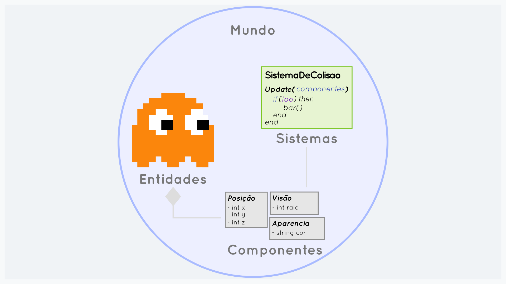
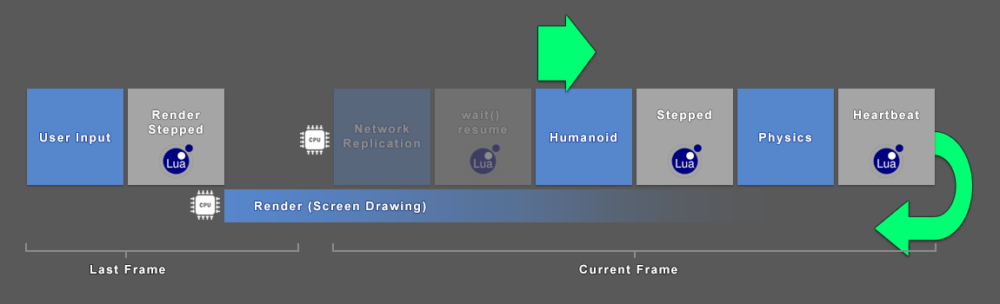

# O que é?

**ECS Lua** é um motor ECS (Entity Component System) rápido e fácil de usar para o desenvolvimento de jogos.



A ideia básica desse padrão é deixar de fazer a definição de entidades usando uma [hierarquia](https://pt.wikipedia.org/wiki/Heran%C3%A7a_(programa%C3%A7%C3%A3o_orientada_a_objetos)) de classes e passar a fazer 
uso de [composição](https://pt.wikipedia.org/wiki/Composi%C3%A7%C3%A3o_de_objetos) em um paradigma de Programação Orientada a Dados.
([Mais informações na Wikipedia](https://en.wikipedia.org/wiki/Entity_component_system)).
A programação com um ECS pode resultar em um código mais eficiente e fácil de estender no longo do tempo.


# Como ele funciona?




# Falar é fácil. Me mostre o código!

```lua
local World, System, Query, Component = ECS.World, ECS.System, ECS.Query, ECS.Component

local Health = Component(100)
local Position = Component({ x = 0, y = 0})

local isInAcid = Query.Filter(function()
   return true  -- it's wet season
end)

local InAcidSystem = System("process", Query.All( Health, Position, isInAcid() ))

function InAcidSystem:Update()
   for i, entity in self:Result():Iterator() do
      local health = entity[Health]
      health.value = health.value - 0.01
   end
end

local world = World({ InAcidSystem })

world.Entity(Position({ x: 5.0 }), Health())
```
    
# Recursos

O **ECS Lua** nao possui dependencias externas e é compativel e testada com [Lua 5.1], [Lua 5.2], [Lua 5.3], [Lua 5.4], 
[LuaJit] e [Roblox Luau](https://luau-lang.org/)

- **Agnóstico de engine de jogo**: Pode ser usado em qualquer motor que tenha a linguagem de script Lua
- **Ergonômico**: Focado em fornecer uma API simples, mas eficiente
- **FSM**: Máquinas de Estados Finitos de maneira fácil e intuitiva
- **JobSystem**: Para a execucao de sistemas em paralelo (por meio de [coroutines](http://www.lua.org/pil/9.1.html))
- **Reativo**: Os sistemas podem ser informado quando uma entidade sofrer alteracao
- **Previsível**:
   - Os sistemas funcionarão na ordem em que foram registrados ou com base na prioridade definida ao registrá-los
   - Os eventos reativos não geram um retorno de chamada aleatório quando emitidos, sao executados em um passo pre-definido

# Objetivo

Ser uma biblioteca ECS leve, simples, ergonomica e de alto desempenho que pode ser facilmente estendida. O **ECS Lua** 
não segue estritamente o "design ECS puro".

# Próximos passos

Você pode navegar ou buscar assuntos específicos no menu lateral. A seguir, alguns links relevantes:

<br>
<br>

<div class="home-row clearfix" style="text-align:center">
   <div class="home-col"><div class="panel home-panel"><div class="panel-body">

   [](/pt-br/getting-started?id=instalação)

   </div><div class="panel-heading">

   [Instalação](/pt-br/getting-started?id=instalação)

   </div></div></div>

   <div class="home-col"><div class="panel home-panel"><div class="panel-body">

   [](/pt-br/getting-started?id=conceitos-gerais)

   </div><div class="panel-heading">

   [Conceitos Gerais](/pt-br/getting-started?id=conceitos-gerais)

   </div></div></div>

   <div class="home-col"><div class="panel home-panel"><div class="panel-body">

   [](/pt-br/architecture)

   </div><div class="panel-heading">

   [Arquitetura](/pt-br/architecture)

   </div></div></div>

   <div class="home-col"><div class="panel home-panel"><div class="panel-body">

   [](/pt-br/tutorial)

   </div><div class="panel-heading">

   [Tutoriais](/pt-br/tutorial)

   </div></div></div>
</div>

[Lua 5.1]:https://app.travis-ci.com/github/nidorx/ecs-lua
[Lua 5.2]:https://app.travis-ci.com/github/nidorx/ecs-lua
[Lua 5.3]:https://app.travis-ci.com/github/nidorx/ecs-lua
[Lua 5.4]:https://app.travis-ci.com/github/nidorx/ecs-lua
[LuaJit]:https://app.travis-ci.com/github/nidorx/ecs-lua
