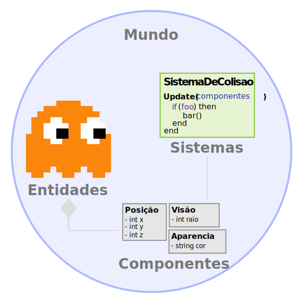

# Primeiros Passos

O **ECS Lua** é um motor de Entity Component System (ECS) feito em [Lua](https://www.lua.org/) usado para 
desenvolvimento de jogos.
A ideia básica desse padrão é deixar de fazer a definição de entidades usando uma [hierarquia](https://pt.wikipedia.org/wiki/Heran%C3%A7a_(programa%C3%A7%C3%A3o_orientada_a_objetos)) de classes e passar a fazer 
uso de [composição](https://pt.wikipedia.org/wiki/Composi%C3%A7%C3%A3o_de_objetos) em um paradigma de Programação Orientada a Dados.
([Mais informações na Wikipedia](https://en.wikipedia.org/wiki/Entity_component_system)).
A programação com um ECS pode resultar em um código mais eficiente e fácil de estender no longo do tempo.


## Instalação

O **ECS Lua** nao possui dependencias externas, portanto, basta fazer o download da ultima versao disponível na 
[página de releases](https://github.com/nidorx/ecs-lua/releases) do projeto.

Existem 3 opcoes de uso do **ECS Lua** 

1. **ECS.lua** Versao minificada em um único arquivo 
1. **ECS_concat.lua** Versao concatenada com os comentarios originais, que pode ser usada para depuracao durante o 
desenvolvimento 
1. **ECS.zip** Versao com os arquivos do diretorio `src`. 
   > Importante! Todos os arquivos fazem o `require` para as dependencias que estão no mesmo diretorio, caso esteja 
   usando em um projeto Lua, registrar no `package.path`.

   > Estes `require` nao funcionam no Roblox Luau, devido ao formato de importacao que o Roblox usa. 

Após importar o **ECS Lua**, ele está pronto para ser usado. O **ECS Lua** registra a variavel global `_G.ECS` para 
facilitar o uso, portanto, voce pode usar o motor nas duas formas `local ECS = require("ECS")` 
(no Roblox `local ECS = require(game.ReplicatedStorage:WaitForChild("ECS"))`) ou simplesmente `_G.ECS`.


### LoopManager

Para que os sistemas do mundo recebam atualizacao, é necessário que o método `World:Update(step, now)` seja invocado em 
cada frame. Para automatizar este processo, o **ECS** disponibiliza uma funcionalidade para que, no momento da 
instanciacao de um novo mundo, este possa registrar-se para receber o update de forma automatica. 

A implementacao desse método é muito simples e mais detalhes pode ser visto na seção 
[Arquitetura - Ciclo De Vida](/pt-br/architecture?id=world).

> Se você utiliza Roblox nao precisa preocupar-se, o **ECS Lua** já tem uma implementacao padrão quando é executado no 
Roblox, mais detalhes abaixo.


### Roblox

Você pode fazer a instalação diretamente do Roblox Studio, através da busca na caixa de ferramentas por `ECS-lua`, esta 
é a versão [minificada do motor](https://www.roblox.com/library/5887881675/ecs-lua). Ao usar o **ECS Lua** no Roblox, 
a engine já identifica e registra automaticamente um `LoopManager`, nao sendo portanto necessario nenhum passo adicional.

## Conceitos Gerais

Alguns termos comuns nos motores ECS são:
- [Entidades](/pt-br/architecture?id=entidade): Um objeto com um ID exclusivo que pode ter vários componentes anexados a ele.
- [Componentes](/pt-br/architecture?id=componente): Diferentes caracteristicas de uma entidade. ex: geometria, física, pontos de vida. Os dados são armazenados apenas em componentes.
- [Sistemas](/pt-br/architecture?id=sistema): Faz o trabalho real, aplica as regras do jogo, processando entidades e modificando seus componentes.
- [Consultas](/pt-br/architecture?id=consulta): Usado pelos sistemas para determinar em quais entidades eles estão interessados, com base nos componentes que as entidades possuem.
- [Mundo](/pt-br/architecture?id=mundo): Um contêiner para entidades, componentes, sistemas e consultas.

<div align=center>



</div>

O fluxo de trabalho normal ao construir um programa baseado em ECS:
- Crie os `Componentes` que moldam os dados que você precisa usar em seu jogo/aplicativo.
- Crie os `Sistemas` que usarão esses `Componentes` para ler e transformar os dados das entidades.
- Crie `Entidades` e anexe `Componentes` a elas.
- Execute todos os sistemas a cada frame, realize `Consultas` no `Mundo` para decidir quais entidades serão modificadas.

## Componente

Os componentes são objetos que contêm dados. No **ECS Lua**, basta invocar o método `ECS.Component(template)` para 
definir uma `Classe` de um componente. 

O parametro `template` pode ser de qualquer tipo, onde: 
- Quando `table`, este template sera usado para a criacao de instancias de componentes;
- Quando for uma `function`, essa sera invocada na instanciacao. 
- Caso o tipo do template seja diferente, o **ECS Lua** ira gerar um template no formato `{ value = template }`, este é o 
formato usado no componente `Acceleration` abaixo.

```lua
local Position = ECS.Component({ 
   x = 0, y = 0, z = 0 
})

-- o mesmo que:
-- ECS.Component({ value = 0.1 })
local Acceleration = ECS.Component(0.1) 
```
[Mais informações sobre como criar componentes](/pt-br/architecture?id=componentes).

## Sistemas e Consultas

Agora vamos definir um [sistema](/pt-br/architecture?id=systems) para processar os componentes que acabamos de criar. Um 
sistema pode implementar diversos métodos, neste exercício vamos usar apenas o método `Update(Time)`. Este método será
invocado em todo frame, no passo `process` do mundo.

Para criar um sistema, usamos o método `ECS.System(step, order, query, updateFn)`. Este método recebe os seguintes 
parametros:
- **`step`** String, aceita os valores `process`, `transform`, `render` ou `task`
- **`order`** Number (Opcional, padrão 50), permite definir uma ordem de execucao para sistemas que não são do tipo `task`
- **`query`** Query (Opcional), filtra as entidades que serão processadas por este sistema
- **`updateFn`** Function (Opcional), um atalho para criacao de sistemas que so possuam o método Update

Nós também vamos definir uma `Query`, que é a consulta que usaremos para obter apenas as entidades que estamos 
interessados.

Pra criar a query, nós podems usar os métodos `Query.All(Component)`, `Query.Any(Component)` e 
`Query.None(Component)`. Ao invocar qualquer um destes métodos um `QueryBuilder` é retornado, desse modo voce pode 
invocar os outros métodos na sequencia Ex. `Query.All(ComponentA).Any(ComponentB).None(ComponentC).Build()`.

Vamos começar criando um sistema que fará um loop por todas as entidades que possuem um componente `Position` e 
registrar suas posições.

```lua
-- um atalho para os métodos
local System, Query = ECS.System, ECS.Query 

local PositionLogSystem = System("process", 2, Query.All(Position), function(self, Time)

   -- Iterar por todas as entidades na consulta
   self:Result():ForEach(function(entity)
      -- Acessa o componente `Position` na entidade atual
      local pos = entity[Position]

      local msg = "Entidade com ID: %d tem o componente Position = {x: %0.2f, y: %0.2f, z: %0.2f}"
		print(msg:format(entity.id, pos.x, pos.y, pos.z))
   end)
end)
```

O próximo sistema move cada entidade que tem uma posição e uma aceleração.

```lua
local MovableSystem = System("process", 1, Query.All(Acceleration, Position)) 

-- Este método será chamado em todos os quadros por padrão
function MovableSystem:Update(Time)

   local delta = Time.DeltaFixed

   -- Iterar por todas as entidades na consulta
   for i, entity in self:Result():Iterator() do
      local acceleration = entity:Get(Acceleration).value

      local position = entity[Position]
      position.x = position.x + acceleration * delta
      position.y = position.y + acceleration * delta
      position.z = position.z + acceleration * delta
   end
end
```

> Observe que estamos acessando componentes em uma entidade de duas formas diferentes: `entity:Get(Acceleration)` tem o 
mesmo resultado que `entity[Acceleration]`


A consulta do sistema sistema `MovableSystem` filtra as entidades que possuem os componentes `Acceleration` e 
`Position`. Observe que, se necessário, podemos criar quantas consultas desejarmos e processá-las no método `Update`, ex:

```lua
local SystemDemo =  System("process", 1)  

function SystemDemo:Initialize(config)
   self.queryBoxes = Query.All(Box).Build()
   self.queryBalls = Query.All(Ball).Build()
   self.queryGeometries = Query.Any(Box, Ball).Build()
end

function SystemDemo:Update(Time)
   local boxes = self:Result(self.queryBoxes):ToArray()
   local balls = self.World:Exec(self.queryBalls):ToArray()
   for i, entity in self:Result(self.queryGeometries):Iterator() do
      print(entity[Box], entity[Ball])
   end
end
```

Para obter mais informações, verifique a documentação de arquitetura: [Acessando e modificando componentes](/manual/Architecture?id=accessing-components-and-modify-components) e [Queries](/manual/Architecture?id=reactive-queries)


## Mundo

Um mundo é um contêiner para `entidades`, `componentes` e `sistemas`. A maioria dos jogos tem apenas um `mundo`,
entretanto, você pode ter vários mundos funcionando ao mesmo tempo e habilitá-los ou desabilitá-los conforme necessário.

A criacao de um mundo é feita pelo método `ECS.World(systemClasses, frequency, disableAutoUpdate)`, onde:

- **systemClasses** Array de classes de sistemas, opcional
- **frequency** Number (Opcional, padrao 30), permite definir a frequencia que o passo `process` será executado no mundo.
- **disableAutoUpdate** Bool (Opcional, padrao false), quando diferente de `false`, o mundo registra-se automaticamente 
no `LoopManager`, recebendo deste a invocacao do método `World:Update()`

Vamos começar a criar nosso primeiro mundo:

```lua
local world = ECS.World();
```

Agora vamos registrar nossos sistemas no mundo para que sejam inicializados e executados em cada quadro.

```lua
world:AddSystem(PositionLogSystem)
world:AddSystem(MovableSystem)
```

## Entidade

Tendo nosso mundo, alguns componentes e sistemas já definidos, vamos criar [entidades](/pt-br/architecture?id=entidades) 
e anexar estes componentes a eles:

```lua
local entity1 = world:Entity(Position())

local entity2 = world:Entity(
   Position({x = 5}), 
   Acceleration(1)
)

local entity3 = world:Entity(
   Position.New({x = 5}), 
   Acceleration.New(1)
)

local entity4 = world:Entity(
   Position({x = 5}), 
   Acceleration({value = 1})
)

local entity5 = world:Entity()
entity5[Position] = { y = 5 }
entity5:Set(Acceleration())

local entity6 = world:Entity()
entity6[Position] = Position()
entity6:Set(Acceleration())
```

Com isso, acabamos de criar 6 entidades. 5 com os componentes `Acceleration` e `Position`, e um apenas com o componente `Position`.

Observe que existem varias formas de instanciar e atribuir os componentes para a entidade, escolha a que mais combina 
com o seu estilo de programção, o resultado final é o mesmo. Perceba também que as classes dos componentes podem ser 
usadas [como funcoes](http://lua-users.org/wiki/FuncTables), por exemplo `Position()`. Este formato tem o mesmo efeito 
que `Position.New()`.


## Juntando tudo

Agora o mundo só precisa ser atualizado (`world.Update(step, now)`) para que tudo funcione. Se voce usa roblox, basta 
criar um Local Script que o mundo já sera atualizado automaticamente.


```lua
-- No Roblox:
local ECS = require(game.ReplicatedStorage:WaitForChild("ECS"))

-- um atalho para os métodos
local Component, System, Query = ECS.Component, ECS.System, ECS.Query 

--[[ Componentes ]]
local Position = Component({ x = 0, y = 0, z = 0 })
local Acceleration = Component(0.1)


--[[ Sistemas ]]
local PositionLogSystem = System("process", 2, Query.All(Position), function(self, Time)

   -- Iterar por todas as entidades na consulta
   self:Result():ForEach(function(entity)
      -- Acessa o componente `Position` na entidade atual
      local pos = entity[Position]

      local msg = "Entidade com ID: %d tem o componente Position = {x: %0.2f, y: %0.2f, z: %0.2f}"
		print(msg:format(entity.id, pos.x, pos.y, pos.z))
   end)
end)

local MovableSystem = System("process", 1, Query.All(Acceleration, Position)) 

-- Este método será chamado em todos os quadros por padrão
function MovableSystem:Update(Time)

   local delta = Time.DeltaFixed

   -- Iterar por todas as entidades na consulta
   for i, entity in self:Result():Iterator() do
      local acceleration = entity:Get(Acceleration).value

      local position = entity[Position]
      position.x = position.x + acceleration * delta
      position.y = position.y + acceleration * delta
      position.z = position.z + acceleration * delta
   end
end

--[[ Mundo ]]
local world = ECS.World();
world:AddSystem(PositionLogSystem)
world:AddSystem(MovableSystem)

--[[ Entidades ]]
local entity1 = world:Entity(Position())
local entity2 = world:Entity(Position({x = 5}), Acceleration(1))
local entity3 = world:Entity(Position.New({x = 5}), Acceleration.New(1))
local entity4 = world:Entity(Position({x = 5}), Acceleration({value = 1}))

local entity5 = world:Entity()
entity5[Position] = { y = 5 }
entity5:Set(Acceleration())

local entity6 = world:Entity()
entity6[Position] = Position()
entity6:Set(Acceleration())
```

Resultado do código acima no Roblox Studio


## Próximos passos
Esta foi uma visão geral rápida sobre como as coisas são estruturadas usando **ECS Lua**, 
[leia a documentação da arquitetura](/pt-br/architecture) para informações mais detalhadas.
